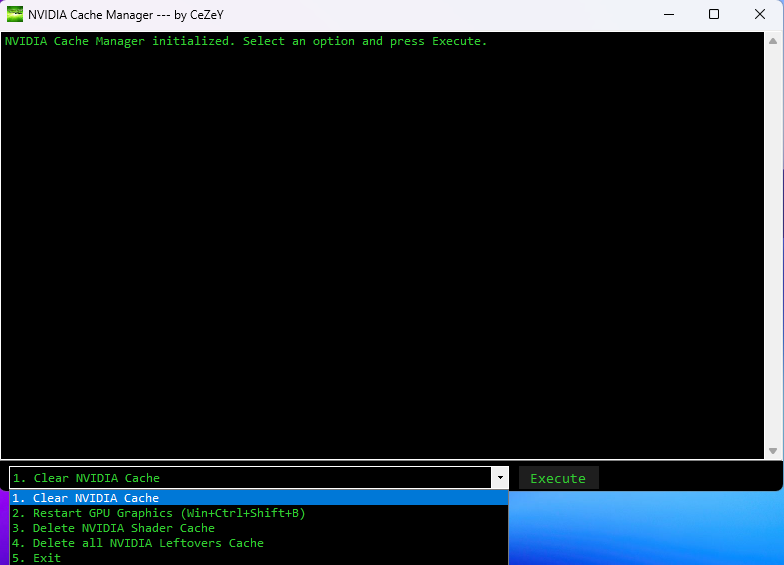

# NVIDIA Cache Manager 
A simple cache manager for nvidia users that is usefull for cleaning temp files and free up space and even help your gpu run better because of shader deleting.

## ⚙️ Features
- Can clear nvidia cache
- Can clear nvidia shader cache
- Delete all nvidia leftovers cache
- Restart GPU Graphics (Fast System)
- Log system (monitors and logs everything the program does located in C:\Users\YOURUSER\AppData\Roaming\NCMCeZeY

